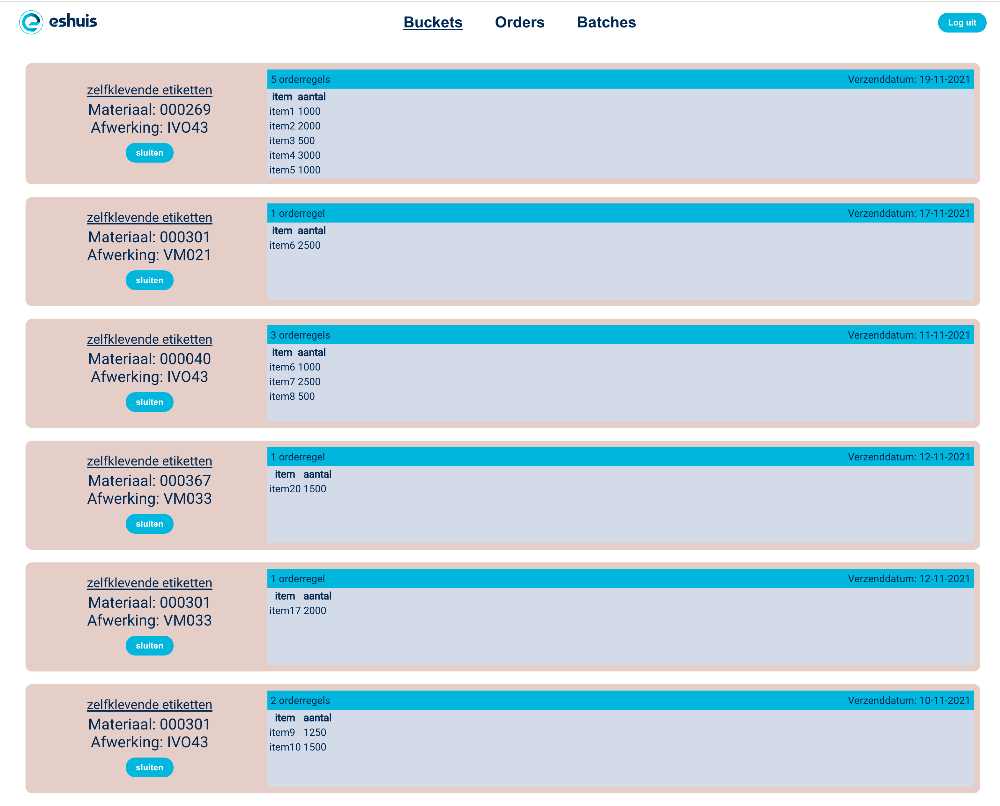

# Web2PackFlow

## Inleiding

Deze applicatie is gemaakt in opdracht van Drukkerij Eshuis in het kader van de leerlijn Frontend van Hogeschool NOVI
Met deze applicatie kunnen orders geplaatsts via een webshop, in 'buckets' verzameld worden
en vervolgens als 'batches' doorgezet worden naar productie.
De orders komen uit een webshop die geïntegreerd is met de [corporate website](https://www.eshuis.nl/etiketten-op-rol.html).



## Randvoorwaarden

De benodigde JAVA backend moet opgestart zijn om applicatie volledig te laten werken,
 zie bijgeleverde "backend.zip" voor de code en de installatiehandleiding hiervan.


## Applicatie starten

Open de applicatie in Webstorm.
installeer eerst de benodigde `node_modules` door het volgende commando in de terminal te runnen:

```
npm install
```

Wanneer dit klaar is, kun je de applicatie starten met behulp van:

```
npm start
```

of gebruik de WebStorm knop (npm start). 
Open [http://localhost:3000](http://localhost:3000/) om in de browser om de applicatie te gebruiken


 ## Inloggen
 
Er zijn 2 gebruikers met verschillende rollen beschikbaar om in te loggen:

### rol User

* gebruikersnaam: "user1"   |   wachtwoord: "111111"

Gebruik deze rol om het "productie gedeelte" van de applicatie te kunnen gebruiken.


### rol Admin

* gebruikersnaam: "admin"   |   wachtwoord: "password"

Gebruik deze rol om ook het "beheers gedeelte" van de applicatie te kunnen gebruiken.


